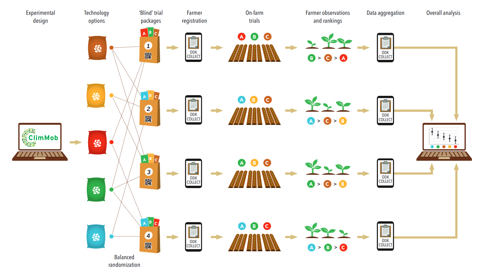
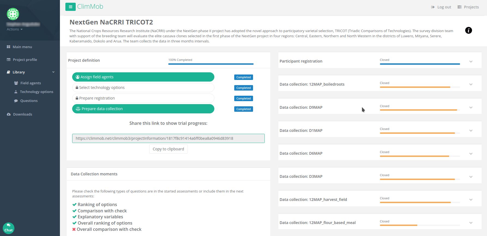

[](https://circleci.com/gh/BioversityCostaRica/py3ClimMob)
[](https://github.com/python/black)

# ClimMob

ClimMob is software for agricultural citizen science with the following features:

- Organize large-scale experiments.
- Invite participation of thousands of volunteering citizen scientists: farmers, consumers and others.
- Test different technology options, such as crop varieties, food products, or agronomic practices.
- Streamline the experimental cycle with electronic forms and barcodes.
- Get quick insights from extensive automatic reports.
- Use a suite of open-source tools to gain in-depth understanding trends and patterns.

For more information visit https://climmob.net

## The tricot approach

ClimMob supports a novel approach to citizen science: the tricot approach. Tricot approach simplifies the experimental process.

| *Digital*        | Researchers and citizen scientists collaborate digitally using ClimMob. Digital communication saves time and money. |
| ---------------- | ------------------------------------------------------------ |
| *Robust*         | From a pool of technology options, ClimMob randomly assigns each participant a combination of three options to test. This way, each option is tested many times. |
| *Representative* | Participants test technology options under real use conditions, such as their own field or kitchen. |
| *Simple*         | Participants mainly use ranking (ordering from best to worst) to report their results. |
| *Insightful*     | ClimMob lets you joins all the data and applies sophisticated statistical analytics at the touch of a button. |
| *Fast*           | Participants and researchers immediately get the information back and can start to discuss the results! |
| *Scientific*     | The tricot approach has been tested scientifically across many research projects. |

*Tricot* stands for ‘*tri*adic *co*mparison of *t*echnology options’. The approach derives it name from the fact that citizen scientists compare multiple technology options in sub-sets of just three, in ‘triads’.



Click [here](https://climmob.net/blog/wiki/about-tricot/) for more information about the tricot approach.

## The software

ClimMob is a Web-based App created using Python, MySQL, [R](https://github.com/AgrDataSci/ClimMob-analysis), and several other third-party tools. The best way to have a ClimMob server is by using Docker. See below. 

### ScreenShot



### Releases

The current stable release is 3.5.0 and it is available [here](https://github.com/BioversityCostaRica/py3ClimMob/tree/stable-3.5.0)

The database signature for stable 3.5.0 is 915e1e3bc787

The Docker image for stable 3.5.0 is 20220203

### Installation

ClimMob comes as as Docker container. The below is a common recipe for running ClimMob using docker:

```sh
# From a fresh installation of Ubuntu 18.04.03 from https://ubuntu.com/download/server
# Update the repositories and packages
sudo add-apt-repository multiverse
sudo apt-get update
sudo apt-get -y upgrade

# Install docker-compose
sudo apt-get install -y docker-compose

# Get the Docker Compose file
cd /opt
sudo mkdir climmob_docker_compose_20220203
cd climmob_docker_compose_20220203
sudo wget https://raw.githubusercontent.com/BioversityCostaRica/py3ClimMob/stable-3.5.0/docker_compose/docker-compose.yml

# Make the directory structure for ClimMob
sudo mkdir /opt/climmob
whoami=$(whoami)
sudo chown $whoami /opt/climmob
mkdir /opt/climmob/celery
mkdir /opt/climmob/log
mkdir /opt/climmob/repository
mkdir /opt/climmob/config
mkdir /opt/climmob/mysql
mkdir /opt/climmob/plugins
sudo chmod -R g+w /opt/climmob

# Download all the required Docker Images
cd /opt/climmob_docker_compose_20220203
sudo docker-compose pull

# Edit the docker-compose.yml file to set the MySQL root password
sudo nano /opt/climmob_docker_compose_20220203/docker-compose.yml
# Press Alt+Shit+3 to show the line numbers in Nano

Edit line 7: Change the root password from "my_secure_password" to your password
Edit line 19: Change the root password from "my_secure_password" to the same password of line 7
Edit line 22: Change the IP address for the IP address of the machine running the Docker service

# Save the file with Ctlr+o Enter . Exit with Ctrl+x

# In AWS if you use MySQL >= 8 in a RDS service you need to add the following permissions to your RDS root user:
# GRANT SESSION_VARIABLES_ADMIN ON *.* TO 'my_RDS_root_user'@'%';
# GRANT SYSTEM_VARIABLES_ADMIN ON *.* TO 'my_RDS_root_user'@'%';

# Install Apache Server
sudo apt-get install -y apache2

# Enable proxy for Apache
sudo ln -s /etc/apache2/mods-available/proxy.conf /etc/apache2/mods-enabled/
sudo ln -s /etc/apache2/mods-available/proxy.load /etc/apache2/mods-enabled/
sudo ln -s /etc/apache2/mods-available/proxy_http.load /etc/apache2/mods-enabled/

# Edit the apache configuration to proxy pass ClimMob 
sudo nano /etc/apache2/sites-enabled/000-default.conf
# Add the following lines after line 28
        ProxyRequests Off
        ProxyPreserveHost On
   
        ProxyPass           /climmob    http://127.0.0.1:5900/climmob
        ProxyPassReverse    /climmob    http://127.0.0.1:5900/climmob
  
        <Proxy *>
           allow from all
        </Proxy>
        ProxyTimeout 120
           
# Save the file with Ctlr+o Enter . Exit with Ctrl+x
# Stop the Apache server
sudo service apache2 stop
# Start the Apache server
sudo service apache2 start

# Start the ClimMob containers. The first time you start the container ClimMob will construct the database and apply all updates. This will take about 5 minutes.
# Subsequent start will take about 2 minutes. You can check the status with "sudo docker stats". 
# ClimMob will be ready for usage when the container reaches more than 700 kB of MEM USAGE
# This is the only two commands you need to start ClimMob after a server restart
cd /opt/climmob_docker_compose_20220203
sudo docker-compose up -d

# Browse to ClimMob
http://[this server IP address]/climmob
```

### Documentation

Documentation and other resources about ClimMob are available at the [ClimMob Documentation Site](https://climmob.net/blog/wiki/).

### Customization and extension

ClimMob uses [PyUtilib Component Architecture](http://citeseerx.ist.psu.edu/viewdoc/download?doi=10.1.1.616.8737&rep=rep1&type=pdf) to allow customization and extension. The best way to do it is by using the [ClimMob Plugin CookieCutter](https://github.com/BioversityCostaRica/climmob-plugin-cookiecutter) and explore the different Interfaces.

What can you do through extension plug-ins? Some ideas:

- Integrate the ClimMob login with your company Windows Authentication.
- Change the colors, logos, and all aspects of the user interface.
- Integrate messaging services like WhatsApp to inform field agents when a new version of a data collection form is up.
- Collect data using USSD or IVR services with the same ODK form and store the data in the same way no matter the source.

You basically can extend ClimMob to fit your needs.

Some examples of plug-ins are:

- [BreedBase](https://github.com/BioversityCostaRica/brapi_plugin). This plug-in allows you to integrate ClimMob with [BreedBase](https://breedbase.org/) Servers by storing project information as studies.
- [Ontology](https://github.com/BioversityCostaRica/ontology_plugin). This plug-in allows you to integrate ClimMob with [CropOntology.org](https://cropontology.org/) by linking ranking questions with ontological variables.

### Localization

ClimMob comes out of the box in English and Spanish. It uses Babel for translation and you can help us by creating new translations or by correcting an existing one.

To generate a new translation:

```
$ cd climmob
$ python setup.py init_catalog -l [new_language_ISO_639-1_code]
$ python setup.py extract_messages
$ python setup.py update_catalog
```

The translation files (.po) are available at climmob/locale/[language-code]/LC_MESSAGES. You can edit a .po file with tools like [PoEdit](https://poedit.net/download), [Lokalize](https://userbase.kde.org/Lokalize), [GTranslator](https://gitlab.gnome.org/GNOME/gtranslator), or a simple text editor. Once the translation is done you can send us the updated or new .po file as an issue and we will add it to ClimMob.

## Partners

The development of ClimMob and the scientific research behind the tricot approach has been possible thanks to investments by the following partners:

- CGIAR Research Programme on Climate, Agriculture and Food Security.
- United States Agency for International Development (USAID).
- Collaborative Crop Research Program, McKnight Foundation.
- Department of International Development, United Kingdom (now: Foreign, Commonwealth & Development Office).
- CGIAR Research Programme on Roots, Tubers and Bananas.
- Bill and Melinda Gates Foundation.

## License and copyrights

ClimMob is Copyright 2021, Alliance of Bioversity International and CIAT. The software is released in the terms of GNU Affero General Public License v3.0. The plug-in architecture of ClimMob is based on [PyUtilib Component Architecture](https://pypi.python.org/pypi/PyUtilib) (PCA) which is licensed under BSD, therefore the [code](https://github.com/BioversityCostaRica/py3ClimMob/tree/master/climmob/plugins) that loads and connects plug-ins is licensed under BSD.